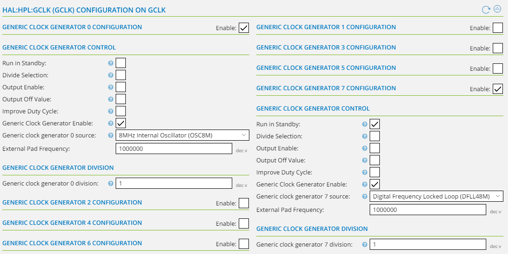
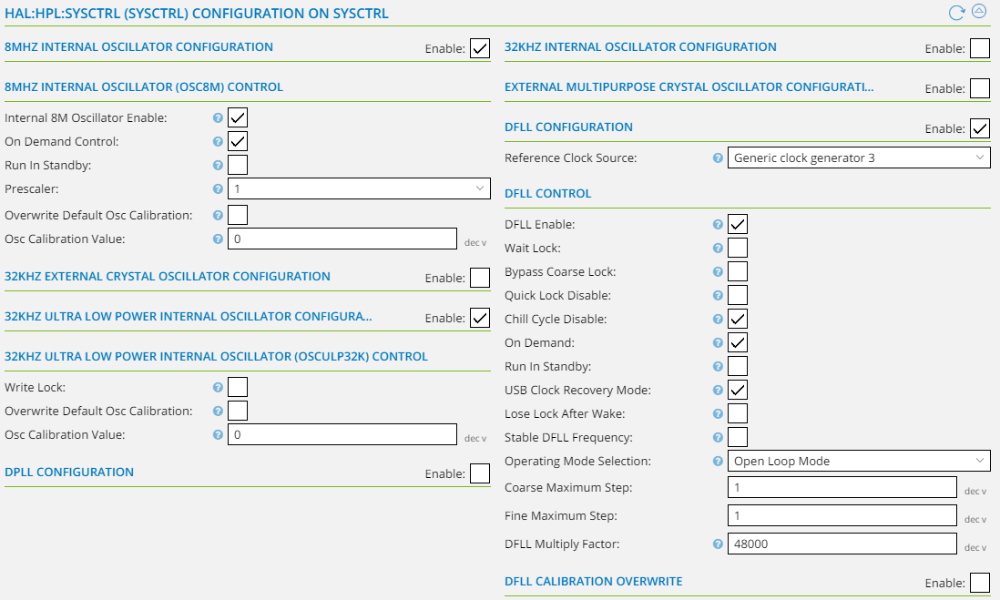
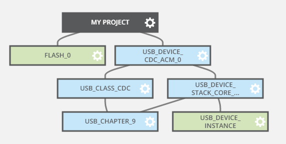

# samd21_usbcdc_reboot

## Summary

Implementation of software boot-to-bootloader reset via USB (CDC) on an Atmel SAMD21G18. Arduino-core also implements this, but this is useful if you don't want to use Arduino libraries just for this feature (e.g. for a custom board). Also implements some other necesities such as a `printf_cdc` and simple console for reading newline terminated ascii strings from the virtual serial port (CDC).

## ASF Project
`samd21_usbcdc_reboot` is a bare-bones ASF project for the SAMD21G18 with the following modifications and additions:

  - USB callbacks for checking for DTR/1200bps
  - Custom reset function starts at flash segment `0x2000` (see Bootloader section below)
  - A redirected `printf_cdc` for virtual serial port io

### Configuration

All of this config is in the project in the repo. If you're doing this from scratch as an ASF project, you can use the notes below

  - Add `.text=0x2000` to the FLASH segment in the linker script (Linker config in Atmel Studio or your Makefile)
  - Set up the 48Mhz GCLK needed for USB (hpl_gclk_config.h or the via the image below)
  
Snapshots of the ASF config if you prefer to set it up that way:

	

	

	

## Bootloader

Since I used a SAMD21 I used the [arduino-core bootloader](https://github.com/arduino/ArduinoCore-samd/tree/master/bootloaders/zero) for the MK-Zero board. 

You need to make some small changes in the `Makefile`:
  - add `CRYSTALLESS` to the extra definitions.
    - example: `CFLAGS_EXTRA=-D__SAMD21G18A__ -DBOARD_ID_$(BOARD_ID) -D$(SAM_BA_INTERFACES) -DCRYSTALLESS`
  - change `SAM_BA_INTERFACES` to `SAM_BA_USBCDC_ONLY`
    - example: SAM_BA_INTERFACES?=SAM_BA_USBCDC_ONLY

This is an 8Kb bootloader, so if you use a different (smaller) one just remember change the flash segment app start address in the previous project.

## VID/PID/String description

By default your virtual serial port will enumerate with a text summary like `ATMEL_CDC_ASF_EXAMPLE`. If you want to change the text summary to something else, check the strings definitions in `usb/class/cdc/device/atmel_devices_cdc.inf:161`.

  
